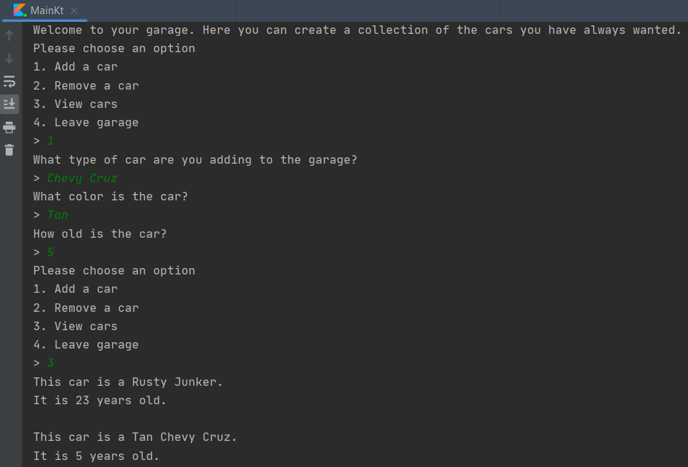

# Overview
A Program used to simulate a car collectors garage. Enables the user to add, remove, and view a collection of cars stored in a list

# Developement Enviroment

* Intellij IDEA
* Kotlin (Part of the Intellij Enviroment)

# Execution

To run the program, open it in intellij and click the "Run" button

# Useful Information

[Kotlin language reference](https://kotlinlang.org/docs/reference/)